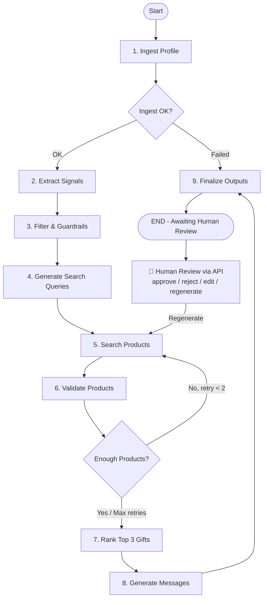
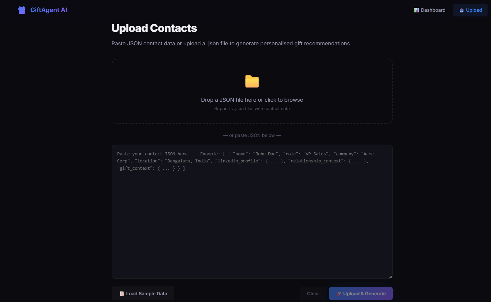
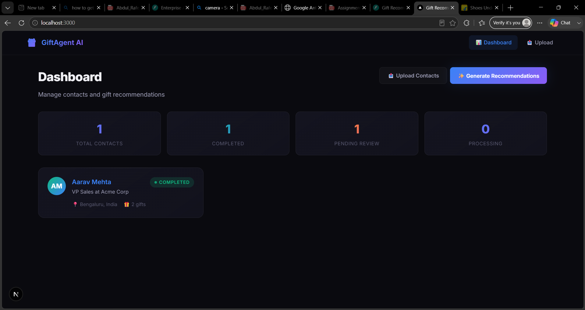
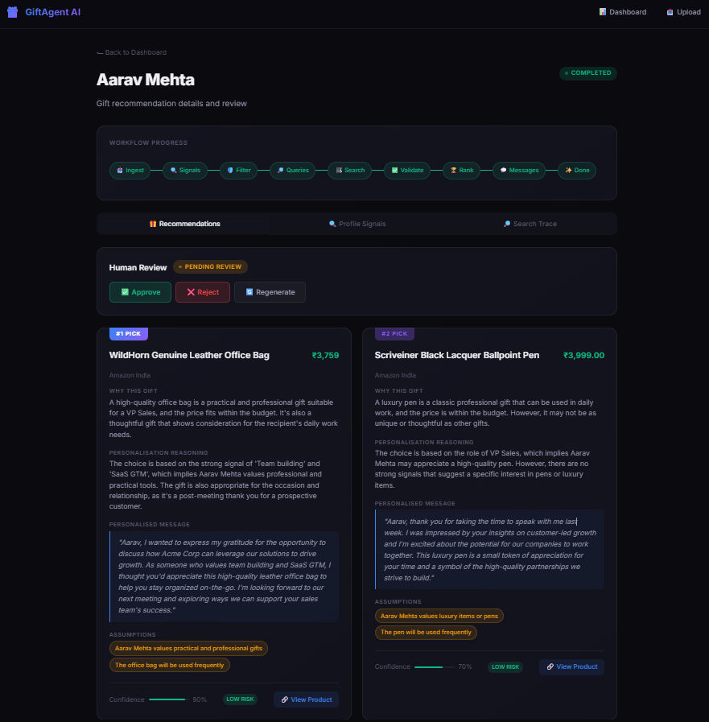

# Hyper-Personalised Gift Recommendation Agent

An AI-powered multi-step agentic workflow built with **FastAPI**, **LangGraph**, and **Next.js** that analyzes professional profiles to recommend real, purchasable gifts with personalized messages.

---

## 🏗️ Architecture & Workflow

The system is built as a stateful directed graph using **LangGraph**. It avoids a single monolithic LLM prompt, instead breaking the problem down into structured nodes with clear guardrails, fallback loops, and human-in-the-loop review capabilities.

### 🤔 Why LangGraph?

The recommendation workflow contains conditional routing, retry loops, shared state, and a human-in-the-loop approval stage. **LangGraph** was chosen because it naturally models stateful workflows with branching, cycling (retries), and human-in-the-loop interventions. Implementing this with a simple sequential chain or agent loop would make error-handling and custom state control extremely complex to maintain.

### 📋 Workflow State Schema

The shared state of the graph is defined in `WorkflowState` and tracks intermediate results across steps:
```python
class WorkflowState(TypedDict):
    contact: dict                 # Raw ingested profile
    contact_id: str               # Unique hash for database/API tracking
    contact_name: str             # Display name of the candidate
    profile_signals: dict         # Extracted strong, weak, and avoid signals
    search_queries: List[str]     # Generated e-commerce search strings
    candidate_products: List[dict]# Products discovered from search tools
    validated_products: List[dict]# Products that passed currency, budget, and guardrail validation
    recommended_gifts: List[dict] # Ranked recommended gifts (up to 3) with custom copy
    workflow_status: str          # pending_review, approved, rejected, etc.
    current_step: str             # Tracks progress (e.g. signal_extraction, ranking)
    _retry_count: int             # Internal loop counter for query retry logic
    _error_message: str           # Traceable error logs in case of node failures
```

### 📂 Project Structure

```text
recomm_agent/
├── backend/                   # Python FastAPI Server
│   ├── app/
│   │   ├── api/               # API Router and REST endpoints
│   │   ├── models/            # Pydantic models & Graph state schemas
│   │   ├── services/          # Search (Tavily/DuckDuckGo) & LLM interfaces
│   │   ├── workflow/          # LangGraph structure (Graph definition, nodes, prompts)
│   │   ├── config.py          # App settings and environment validation
│   │   └── main.py            # API Server initialization
│   ├── run_integration_test.py# Zero-dependency E2E workflow script
│   └── requirements.txt       # Backend dependencies
├── frontend/                  # Next.js React Dashboard
│   ├── src/app/               # Application router, pages, and UI styling
│   └── package.json           # Frontend dependencies
├── screenshots/               # Interface UI images
├── sample_data/               # Sample JSON contacts for testing
└── README.md                  # Detailed developer documentation
```

### LangGraph Workflow Steps



### Key Workflow Components

1. **Ingest Profile**: Accepts contact structured data, including experience, location, budget, and recent social interactions.
2. **Extract Signals**: Identifies interests, hobbies, and professional passions from LinkedIn posts, comments, and headlines.
3. **Filter & Guardrails**: Standardizes and sanitizes signals. Explicitly filters out sensitive attributes (religion, politics, health, family status, ethnicity, gender).
4. **Generate Search Queries**: LLM turns profile signals into localized e-commerce search strings (e.g. `buy premium board game India under 5000 INR`).
5. **Search Products**: Queries Tavily (primary) and DuckDuckGo (fallback) to find real e-commerce listing URLs (Amazon, Flipkart, Etsy, etc.).
6. **Validate Products**: Filters out non-product pages (blogs, wikis), converts currencies if necessary, checks budgets, and uses LLM to check professional appropriateness.
7. **Rank Top 3**: Selects the best gifts (up to 3), scores confidence based on signal strength, and identifies assumptions. It prioritizes trustworthy, validated products over forcing exactly three recommendations if high-quality results are unavailable.
8. **Generate Messages**: Creates a warm, short (2-4 sentences) personalized note referencing mutual context and profile insights.
9. **Human-in-the-Loop**: An interactive human review dashboard displays intermediate signals, search traces, and allows humans to approve, edit, reject, or trigger regeneration.

### 🧠 LLM Responsibilities & Grounding

To prevent hallucinations, the LLM is restricted to analysis, reasoning, and synthesis. It is **never** responsible for inventing or guessing products:

* 🟢 **LLM Responsibilities**: Profile signal extraction, search query generation, professional appropriateness validation, and personalized message generation.
* 🛑 **Deterministic (Grounded) Responsibilities**: Product search (via live e-commerce query APIs), URL structural checks, domain validation, budget filtering, currency conversion, and workflow routing.

### ⚙️ Deterministic vs. AI Components

| Workflow Phase | Component Type | Implementation Details |
|---|---|---|
| Ingest Profile | Deterministic | Schema parsing & data validation |
| Signal Extraction | AI (LLM) | Categorizes profile data into strong/weak/avoid signals |
| Guardrails & Filter | AI & Deterministic | Sanitizes sensitive topics (politics, gender, religion) |
| Query Generation | AI (LLM) | Translates profile signals into localized commercial queries |
| Search Products | Deterministic | Live web query (Tavily with DuckDuckGo fallback) |
| URL & Price Check | Deterministic | Domain filtering & currency/budget checks |
| Appropriateness Check | AI (LLM) | Screens items for professional corporate settings |
| Gift Ranking | AI (LLM) | Selects and ranks up to 3 final gifts from validated products |
| Message Generation | AI (LLM) | Writes custom notes referencing mutual context |
| Human Review / Status | Deterministic | REST endpoints and local state transition logic |

---

## 🛠️ Setup & Execution

### Prerequisites
* Python 3.11+
* `uv` (fast Python package manager)
* Node.js 18+ and `npm`

Ensure your `.env` file exists at the project root folder (named `.env`) with the following variables:
```env
GROQ_API_KEY=your_groq_key
GOOGLE_API_KEY=your_gemini_key
TAVILY_API_KEY=your_tavily_key
```

### 1. Run the Backend (FastAPI)
Using `uv` to manage the virtual environment:
```bash
# Navigate to the backend directory
cd backend

# Install dependencies using uv into your virtual environment
uv pip install -r requirements.txt

# Run the FastAPI server with reload enabled
uv run uvicorn app.main:app --host 0.0.0.0 --port 8000 --reload
```

The API will start running at `http://localhost:8000`. You can inspect the Swagger documentation at `http://localhost:8000/docs`.

### 2. Run the Frontend (Next.js)
```bash
# Navigate to the frontend directory
cd frontend

# Install dependencies
npm install

# Start the development server
npm run dev
```

Open [http://localhost:3000](http://localhost:3000) to view the web application.

### 📸 UI Screenshots
Here is what the interactive dark-mode dashboard, file uploader, and detailed human-in-the-loop review interface look like:

#### 1. Bulk Upload Flow (Supports Drag-and-Drop or Paste JSON)


#### 2. Dashboard (Overview & Recommendation Status)


#### 3. Detailed Human Review Interface (Edit & Verify)


### 🧪 Running Integration Tests (Bonus Point)
You can run an automated end-to-end integration test to verify the complete multi-step backend workflow:
```bash
# Navigate to the backend folder
cd backend

# Run the integration test (requires FastAPI server to be running)
python run_integration_test.py
```
This script will upload a sample profile, trigger the recommendation engine, poll its status, and output the generated gift list, search queries, messages, and confidence levels.

---

## 📊 Evaluation Strategy

To measure the quality and reliability of the recommendation agent, we define the following framework:

| Metric | Measurement Approach | Target / Threshold |
|---|---|---|
| **Gift Relevance** | LLM-as-a-judge comparison of ranked gift tags vs. extracted strong signals. | > 90% alignment score |
| **Product Link Validity** | Automated HTTP HEAD requests to confirm product URLs return status code `200` (no broken links). | 100% active links |
| **Budget & Country Fit** | Parse price and store country domain to check compliance. | 100% within budget constraints (+15% tolerance) |
| **Professional Appropriateness** | Moderation LLM checking recommendations against a list of corporate-prohibited items (alcohol, personal hygiene, intimacy, politics). | 0 violations |
| **Creepiness / Sensitive Guardrails** | Semantic check to verify that no religion, politics, family status, or physical appearance signals are used. | 0 sensitive signals processed |
| **Message Quality** | LLM evaluation of grammatical correctness, tone matching (professional/warm), and check to prevent boilerplate text. | > 4.5/5 rating |
| **Failure Handling Resilience** | Verify search query retry logic loops and fallback to generic, safe gift items (e.g. premium notebook, desk accessories) when search results are poor. | Safe fallback activation |

---

## 🔄 Technical Trade-offs & Future Work

* **State Persistence**: The current system stores active recommendations in-memory (`recommendations_store` in the backend API). For production scale, compile LangGraph with a database-backed checkpointer (e.g. `AsyncMongoDBSaver` using the `DATABASE_URL` in `.env`).
* **E-Commerce Parsing**: Extracting price and details relies on Tavily snippet regex parsing. In a production pipeline, a headless crawler or specialized shopping APIs (Amazon Associate API, Google Shopping API) would provide more stable price, stock, and image extraction.
* **Search Retry Loop**: If validation finds fewer than 2 products, the system increments `_retry_count` and requests broader search queries. This increases latency but prevents failure when specific queries yield empty results. If the retry limit is reached and fewer than three valid products remain, the workflow returns the available validated recommendations instead of inventing or forcing irrelevant products. This prioritizes reliability and grounding over arbitrary completeness.
* **Production Observability**: Future extensions should compile LangGraph with instrumentation like **LangSmith** or OpenTelemetry. This will track agent traces, tool-call execution latency, LLM response tokens, and cost logging for production scalability monitoring.
